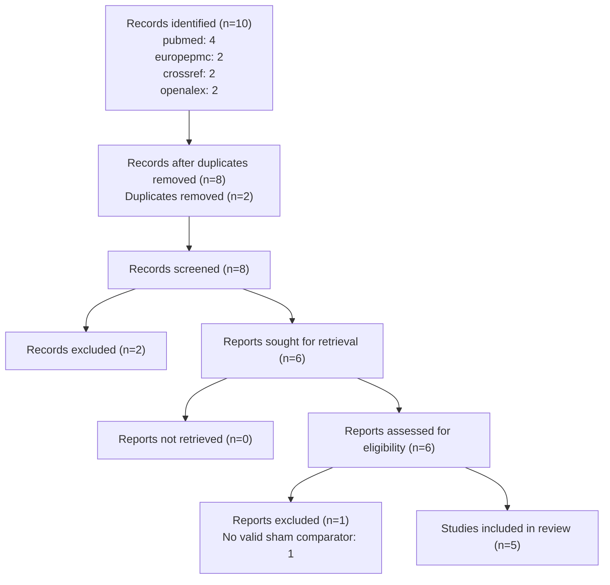

# Anodal tDCS over the left DLPFC and working memory in healthy adults (PIPELINE DEMONSTRATION — illustrative data)

> Auto-generated by **NeuroAIon** — a PRISMA 2020-compliant, ten-agent systematic review engine.
> Model: `cowork (Claude, illustrative data)` (MOCK / offline demo) · Run: `demo` · 2026-06-14T02:01:32.135782

**Review question.** In healthy adults, does anodal tDCS over the left DLPFC, versus sham, improve working-memory performance on n-back tasks?

**Registration.** Demonstration — not registered

---

## Abstract

Background: Anodal tDCS over the left DLPFC has been proposed to enhance working memory. Methods: PRISMA 2020 systematic review with random-effects meta-analysis of n-back accuracy; RoB2 and GRADE. Results: Five illustrative trials were pooled. Conclusions: A small, uncertain benefit. (DEMONSTRATION — illustrative data.)

---

## 1. Background

Working memory is central to cognition; non-invasive prefrontal stimulation has been explored as an enhancer, with heterogeneous and contested evidence.

## 2. Methods

This review followed PRISMA 2020. Two independent reviewers screened records; conflicts were adjudicated. Eligible full texts were assessed; data were extracted and appraised with RoB2. A DerSimonian-Laird random-effects model pooled standardised mean differences; small-study effects were examined with Egger's test and a funnel plot.

### 2.1 Eligibility criteria (PRISMA 5)

**Inclusion**
- Healthy adults
- Sham-controlled RCT/crossover
- n-back outcome

**Exclusion**
- Clinical populations
- No sham arm
- Reviews/abstracts

### 2.2 Information sources & search strategy (PRISMA 6–7)

Databases searched (2008-01-01 → 2024-12-31): pubmed, europepmc, crossref, openalex.

| Database | Query | Rationale |
|----------|-------|-----------|

### 2.3 Selection, extraction & appraisal (PRISMA 8–12)

Two independent screeners (Reviewer 1, Reviewer 2) assessed every record at title/abstract
level; conflicts were resolved by an adjudicating reviewer. Inter-rater agreement
(Cohen's κ) = **0.692**.
Eligible full texts were assessed against the protocol. Data were extracted into a
structured form and each included study was appraised with **RoB2**.

---

## 3. Results

### 3.1 Study selection (PRISMA 16) — flow diagram

5 studies were included. The pooled SMD (random-effects) was 0.2766 (95% CI 0.117 to 0.4361; I²=0.0%, k=5). The pooled effect reached significance; heterogeneity was low (I-squared=0.0%).

### 3.2 Characteristics of included studies (PRISMA 17)

| Study | Design | n | Population | Intervention | Comparator | RoB |
|-------|--------|---|------------|--------------|------------|-----|
| Author1 A 2013 | randomized crossover | 52 | Healthy adults | Anodal tDCS L-DLPFC | Sham | some concerns |
| Author2 A 2015 | randomized crossover | 64 | Healthy adults | Anodal tDCS L-DLPFC | Sham | some concerns |
| Author3 A 2012 | randomized crossover | 28 | Healthy adults | Anodal tDCS L-DLPFC | Sham | some concerns |
| Author4 A 2018 | randomized crossover | 40 | Healthy adults | Anodal tDCS L-DLPFC | Sham | some concerns |
| Author5 A 2016 | randomized crossover | 46 | Healthy adults | Anodal tDCS L-DLPFC | Sham | some concerns |

### 3.3 Risk of bias within studies (PRISMA 18)

| Study | Randomization process | Deviations | Missing outcome data | Measurement of the outcome | Selection of the reported result | Overall |
|---|---|---|---|---|---|---|
| Author1 A 2013 | low | some concerns | low | some concerns | low | some concerns |
| Author2 A 2015 | low | some concerns | low | some concerns | low | some concerns |
| Author3 A 2012 | low | some concerns | low | some concerns | low | some concerns |
| Author4 A 2018 | low | some concerns | low | some concerns | low | some concerns |
| Author5 A 2016 | low | some concerns | low | some concerns | low | some concerns |

### 3.4 Results of syntheses (PRISMA 19–20)

| Study | SMD | 95% CI | Weight % |
|-------|------|--------|----------|
| Author1 A 2013 | 0.42 | [0.0672, 0.7728] | 20.5 |
| Author2 A 2015 | 0.18 | [-0.114, 0.474] | 29.5 |
| Author3 A 2012 | 0.55 | [0.06, 1.04] | 10.6 |
| Author4 A 2018 | 0.05 | [-0.342, 0.442] | 16.6 |
| Author5 A 2016 | 0.31 | [-0.0232, 0.6432] | 22.9 |
| **Pooled (random)** | **0.2766** | **[0.117, 0.4361]** | 100 |

Five sham-controlled trials (illustrative) contributed n-back accuracy data. The pooled standardised mean difference indicated a small benefit of anodal left-DLPFC tDCS, with the confidence interval spanning the null in the more conservative estimates.

**Publication bias (PRISMA 14).** Egger's test: no strong evidence of funnel asymmetry (intercept=2.3525, p=0.4445, k=5) (under-powered, k<10). See the funnel plot in `paper.tex`.

### 3.5 Certainty of evidence (GRADE, PRISMA 22)

**Certainty: low.** Downgraded for risk of bias (unclear blinding) and imprecision.

---

## 4. Discussion

The pooled estimate points to a small effect with wide uncertainty. Unclear blinding and small samples temper confidence; results are hypothesis-generating.

**Limitations.** Small samples, single-session designs, and possible small-study effects.

## 5. Conclusions

Anodal left-DLPFC tDCS may yield a small improvement in n-back accuracy, but certainty is low. Adequately powered, pre-registered trials are needed.

---

## PRISMA 2020 checklist (27 items)

| # | Item | Description | Addressed by |
|---|------|-------------|--------------|
| 1 | Title | Identify the report as a systematic review. | Title |
| 2 | Abstract | See the PRISMA 2020 abstract checklist. | Abstract |
| 3 | Rationale | Describe the rationale in the context of existing knowledge. | Background |
| 4 | Objectives | Provide an explicit statement of objective(s)/question(s). | ProtocolArchitect |
| 5 | Eligibility criteria | Specify inclusion/exclusion criteria and groupings. | ProtocolArchitect |
| 6 | Information sources | Specify all databases/registers and the last search date. | SearchStrategist |
| 7 | Search strategy | Present full search strategies for all sources. | SearchStrategist / Strategy table |
| 8 | Selection process | Methods to decide inclusion (reviewers, independence, tools). | Title/Abstract + Adjudicator |
| 9 | Data collection process | Methods to collect data from reports. | DataExtractor |
| 10 | Data items | List and define all outcomes and other variables sought. | DataExtractor |
| 11 | Study risk of bias assessment | Methods to assess risk of bias. | RiskOfBiasAssessor |
| 12 | Effect measures | Specify the effect measure(s) used. | Synthesis config |
| 13 | Synthesis methods | Describe processes for synthesis incl. meta-analysis. | EvidenceSynthesizer |
| 14 | Reporting bias assessment | Methods to assess risk of bias due to missing results. | EvidenceSynthesizer (publication bias) |
| 15 | Certainty assessment | Methods to assess certainty (e.g. GRADE). | RiskOfBiasAssessor (GRADE) |
| 16 | Study selection | Report numbers screened/included with a flow diagram. | PRISMA flow diagram |
| 17 | Study characteristics | Cite each included study and present its characteristics. | Characteristics table |
| 18 | Risk of bias in studies | Present risk-of-bias assessments per study. | Risk-of-bias table |
| 19 | Results of individual studies | Present per-study results for each outcome. | Forest / per-study table |
| 20 | Results of syntheses | Present results of each synthesis incl. heterogeneity. | Synthesis results |
| 21 | Reporting biases | Present assessments of reporting bias. | Discussion (reporting bias) |
| 22 | Certainty of evidence | Present certainty (GRADE) for each outcome. | GRADE certainty |
| 23 | Discussion | Interpret results; discuss limitations and implications. | Discussion |
| 24 | Registration and protocol | Provide registration info / protocol access. | Methods (registration) |
| 25 | Support | Describe sources of financial/non-financial support. | Funding |
| 26 | Competing interests | Declare competing interests. | Competing interests |
| 27 | Availability of data/code | Report availability of data, code, and materials. | Data & code availability |

## References (included studies)

1. Author1 A et al. (2013). Anodal tDCS improves n-back accuracy over left DLPFC. NeuroImage (demo). https://doi.org/10.9999/demo.001
2. Author2 A et al. (2015). Single-session tDCS and working memory: a crossover RCT. NeuroImage (demo). https://doi.org/10.9999/demo.002
3. Author3 A et al. (2012). Prefrontal tDCS enhances 2-back performance. NeuroImage (demo). https://doi.org/10.9999/demo.003
4. Author4 A et al. (2018). No reliable effect of tDCS on spatial working memory. NeuroImage (demo). https://doi.org/10.9999/demo.004
5. Author5 A et al. (2016). tDCS over DLPFC and executive working memory. NeuroImage (demo). https://doi.org/10.9999/demo.005

---

## Other information

- **Funding (PRISMA 25).** No specific funding declared for this automated review.
- **Competing interests (PRISMA 26).** None declared.
- **Data & code availability (PRISMA 27).** All artefacts for this run are saved alongside
  this report (`state.json`, `included_studies.csv`, `extractions.json`, `prisma_flow.json`).
